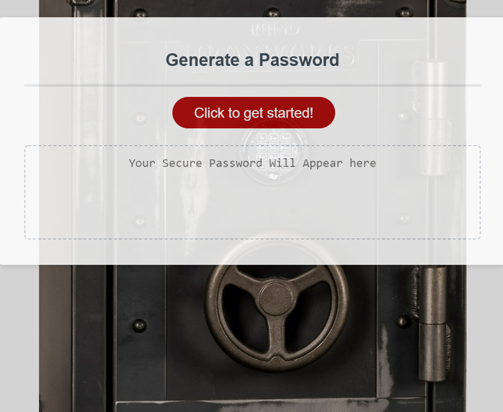

# Password-Generator
This is one of the first of many homework assignments from Coding Bootcamp. While this application is not complicated it serves as an example of basic javascript logic and is useful in the real world. The user can follow the prompts to generate a random password from 8 - 128 characters, including upper and lower case letters, numbers and "special" characters such as "#" and "%." I have changed the css to make it more aesthetically pleasing and I enjoy this particular application.

Github repo: https://github.com/bradfan/Password-Generator

Deployed Link: https://bradfan.github.io/Password-Generator/

